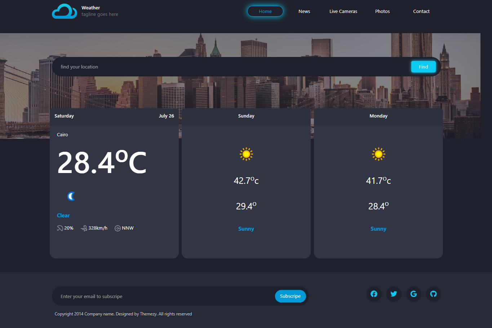

# Weather Forecast Application

This is a simple web application that displays a 3-day weather forecast using the WeatherAPI. Users can search for weather in specific cities or view the default weather for Cairo upon loading the page.

---

### 🚀 Preview :

## 🚀 Features

- **Current Day Weather:** Displays detailed weather information for the current day, including:
  - Day of the week and full date
  - City/Country name
  - Current temperature in Celsius
  - Weather condition icon and text
  - Humidity (placeholder for 20%)
  - Wind speed and direction
- **Next Two Days Forecast:** Shows the forecast for the following two days, including:
  - Day of the week
  - Weather condition icon and text
  - Maximum and minimum temperatures in Celsius
- **City Search:** Users can search for weather by typing a city name in the input field.
- **Dynamic Updates:** Weather data updates automatically as the user types (after 3 characters) or when the "Find" button is clicked.
- **Default Weather:** Loads weather data for Cairo when the page first loads.
- **Error Handling:** Basic error handling for API requests (e.g., network issues, invalid city).
- **Animations:** Uses `animate__animated animate__pulse` for a subtle animation effect on weather cards.

---

## 🛠️ Technologies Used

- **HTML5:** For the structure of the web page.
- **CSS3:** For styling (assumed from class names like `d-flex`, `px-4`, etc., likely using a framework like Bootstrap, which you might want to mention if used).
- **JavaScript (ES6+):** For fetching data, manipulating the DOM, and handling user interactions.
- **WeatherAPI:** External API for fetching weather data.
- **Animate.css:** For CSS animations (`animate__animated animate__pulse`).

---

## 🔑 API Key

## This application uses the **WeatherAPI**.

## 💡 Code Structure Overview

The JavaScript code is organized into three main sections:

### Global Variables

- `innerField`: References the input field where users type city names.
- `btn`: References the "Find" button.
- `todayData`, `tomorrowData`, `dayAfterTomorrowData`: References to HTML elements where weather data for each day will be displayed.
- `alertMessage`: (Declared but not used in the provided JS snippet).

### Helper Functions

- `displayThreeDaysOfWeather(myData)`:
  - Takes the parsed JSON weather data (`myData`) as input.
  - Dynamically generates HTML strings for the current day, tomorrow, and the day after tomorrow.
  - Populates the respective HTML elements (`todayData`, `tomorrowData`, `dayAfterTomorrowData`) with the generated content.
  - Uses `Date.toLocaleDateString` for formatting dates and weekdays.
  - Extracts weather details (temperature, icon, status, wind, etc.) from the API response.

### Main Function

- `getApi(country = "cairo")`:
  - An `async` function responsible for fetching weather data from WeatherAPI.
  - Takes an optional `country` parameter, defaulting to "cairo".
  - Constructs the API URL with the provided key and query.
  - Uses `fetch` to make the API request.
  - Includes basic error handling: if `response.ok` is false (e.g., 404, 500 status), it throws an error.
  - Parses the response as JSON.
  - Calls `displayThreeDaysOfWeather` to render the fetched data.
  - Logs any errors to the console.

### Event Listeners

- **Input Field (`innerField`):**
  - Listens for the `input` event (as the user types).
  - If the typed city name has 3 characters, it triggers `getApi` with that city.
  - If the input field becomes empty, it resets to the default "cairo" weather.
- **"Find" Button (`btn`):**
  - Listens for the `click` event.
  - Behaves similarly to the input field's `input` event: fetches data for the typed city (if 3+ chars) or default city (if empty).
- **Document Load (`DOMContentLoaded`):**
  - When the entire HTML document has been loaded and parsed, it calls `getApi()` to display weather for Cairo by default.
